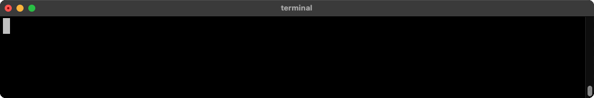
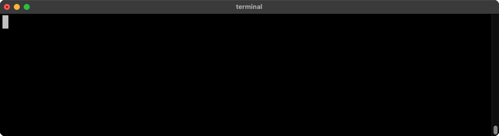
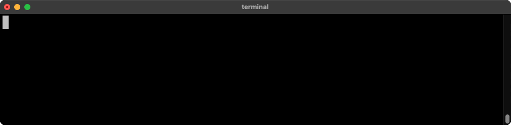

<a name="readme-top"></a>

[![Contributors][contributors-shield]][contributors-url]
[![Issues][issues-shield]][issues-url]
[![Chat][discord-shield]][discord-url]
[![Build][build-shield]][build-url]
[![Version][version-shield]][version-url]
[![Twitter][twitter-shield]][twitter-url]
[![LinkedIn][linkedin-shield]][linkedin-url]


<!-- PROJECT LOGO -->
<br />
<div align="center">
  <picture>
    <source media="(prefers-color-scheme: dark)" width="50%" srcset="https://github.com/candlecorp/.github/blob/main/assets/wick_logo_light@.5.png?raw=true">
    
  </picture>

  <p align="center">
    A flow-based runtime for WebAssembly components.
    <br />
    <a href="https://candle.dev/docs/"><strong>Explore the docs »</strong></a>
    <br />
    <br />
    <a href="#installation">Install</a>
    ·
    <a href="https://github.com/candlecorp/wick/issues">Report Bug</a>
    ·
    <a href="https://github.com/candlecorp/wick/issues">Request Feature</a>
  </p>
</div>


<!-- TABLE OF CONTENTS -->
<details>
  <summary>Table of Contents</summary>
  <ol>
    <li>
      <a href="#about-the-project">About The Project</a>
      <ul>
        <li><a href="#built-with">Built With</a></li>
      </ul>
    </li>
    <li>
      <a href="#getting-started">Getting Started</a>
      <ul>
        <li><a href="#installation">Installation</a></li>
      </ul>
    </li>
    <li><a href="#usage">Usage</a></li>
    <li><a href="#roadmap">Roadmap</a></li>
    <li><a href="#contributing">Contributing</a></li>
    <li><a href="#license">License</a></li>
    <li><a href="#contact">Contact</a></li>
    <li><a href="#acknowledgments">Acknowledgments</a></li>
  </ol>
</details>


<!-- ABOUT THE PROJECT -->
## About The Project

Wick is a low-code, flow-like runtime for stitching together WebAssembly components into full applications. Built With ❤️, Rust, and Wasm.

<p align="right">(<a href="#readme-top">back to top</a>)</p>


## What can you do with Wick?

Wick revolves around components. Components are essentially libraries that export operations, or functions.



Every wick component acts on streams. You can invoke components directly from the command line or combine them to build CLI tools, web applications, or even other components.


We built wick to reduce all the wasted effort in building software. When all pieces of software connect the same way, we can build single tools that work for *everything*.

Like a test runner that can test anything via configuration alone:



Or the ability to audit every resource your application uses *and* validate it in one fell swoop.



<!-- GETTING STARTED -->
## Getting Started

You'll need the `wick` binary to run Wick applications or invoke Wick components. You can install it with one of the following methods:

### Installation

Pick your installation preference:

1. [Cargo](#install-with-cargo)
2. [Homebrew](#install-with-homebrew)
3. [Pre-built binaries](#install-pre-built-binaries)
4. [Install from source](#install-from-source)

#### Install with Cargo

```
cargo install wick-cli
```

<p align="right">(<a href="#readme-top">back to top</a>)</p>

#### Install with Homebrew

```
brew install candlecorp/tap/wick
```

<p align="right">(<a href="#readme-top">back to top</a>)</p>

#### Install pre-built binaries

##### Mac/Linux

```
curl -sSL sh.wick.run | bash
```

##### Windows

```
curl https://ps.wick.run -UseBasicParsing | Invoke-Expression
```

<p align="right">(<a href="#readme-top">back to top</a>)</p>

#### Install from source

```sh
git clone https://github.com/candlecorp/wick.git && cd wick
just deps # install necessary dependencies
just install # or cargo install --path .
```

<p align="right">(<a href="#readme-top">back to top</a>)</p>

<!-- USAGE EXAMPLES -->
## Usage

We're constantly adding examples to the [./examples](https://github.com/candlecorp/wick/tree/main/examples) directory, which we also use as a base for our integration tests.

_For more information, please refer to the [Documentation](https://candle.dev/docs/)_

<p align="right">(<a href="#readme-top">back to top</a>)</p>


<!-- ROADMAP -->
## Roadmap

- [X] HTTP Trigger
- [X] Cron Trigger
- [X] CLI Trigger
- [X] Expand automatic API generation
- [X] audit/lockdown support
- [ ] WebAssembly Component-model support
- [ ] WebSocket support
    - [ ] WebTransport as support improves

See the [open issues](https://github.com/candlecorp/wick/issues) for a full list of proposed features (and known issues).

<p align="right">(<a href="#readme-top">back to top</a>)</p>


<!-- CONTRIBUTING -->
## Contributing

Contributions are what make the open source community such an amazing place to learn, inspire, and create. Any contributions you make are **greatly appreciated**.

If you have a suggestion that would make this better, please fork the repo and create a pull request. You can also simply open an issue with the tag "enhancement".
Don't forget to give the project a star! Thanks again!

1. Fork the Project
2. Create your Feature Branch (`git checkout -b feature/AmazingFeature`)
3. Commit your Changes (`git commit -m 'Add some AmazingFeature'`)
4. Push to the Branch (`git push origin feature/AmazingFeature`)
5. Open a Pull Request

<p align="right">(<a href="#readme-top">back to top</a>)</p>


<!-- LICENSE -->
## License

Wick is distributed under the Elastic License 2.0 and Apache-2.0 licenses. See `LICENSE` for more information and individual crates for details.

<p align="right">(<a href="#readme-top">back to top</a>)</p>

<!-- CONTACT -->
## Contact

[@candle_corp](https://twitter.com/@candle_corp) - jarrod@candle.dev

Project Link: [https://github.com/candlecorp/wick](https://github.com/candlecorp/wick)

<p align="right">(<a href="#readme-top">back to top</a>)</p>


<!-- MARKDOWN LINKS & IMAGES -->
<!-- https://www.markdownguide.org/basic-syntax/#reference-style-links -->
[tests-shield]: https://img.shields.io/github/actions/workflow/status/candlecorp/wick/mono_workflow.yaml
[contributors-shield]: https://img.shields.io/github/contributors/candlecorp/wick.svg
[contributors-url]: https://github.com/candlecorp/wick/graphs/contributors
[version-shield]: https://img.shields.io/crates/v/wick-cli
[version-url]: https://crates.io/crates/wick-cli
[build-shield]: https://img.shields.io/github/actions/workflow/status/candlecorp/wick/mono_workflow.yaml
[build-url]: https://github.com/candlecorp/wick/actions/workflows/mono_workflow.yaml
[discord-shield]: https://img.shields.io/discord/909866379904167947
[discord-url]: https://discord.gg/candle
[issues-shield]: https://img.shields.io/github/issues/candlecorp/wick.svg
[issues-url]: https://github.com/candlecorp/wick/issues
[license-shield]: https://img.shields.io/crates/l/wick-cli
[license-shield2]: https://img.shields.io/crates/l/wick-component
[license-url]: https://github.com/candlecorp/wick/blob/master/LICENSE
[twitter-shield]: https://img.shields.io/badge/-Twitter-black.svg?logo=twitter&colorB=555
[twitter-url]: https://www.twitter.com/@wickwasm
[linkedin-shield]: https://img.shields.io/badge/-LinkedIn-black.svg?logo=linkedin&colorB=555
[linkedin-url]: https://www.linkedin.com/company/candlecorp
[product-screenshot]: images/screenshot.png
[Rust-badge]: https://img.shields.io/badge/rust-000000?style=for-the-badge&logo=rust&logoColor=white
[Rust-url]: https://www.rust-lang.org
[Wasm-badge]: https://img.shields.io/badge/wasm-000000?style=for-the-badge&logo=webassembly&logoColor=white
[Wasm-url]: https://webassembly.org
